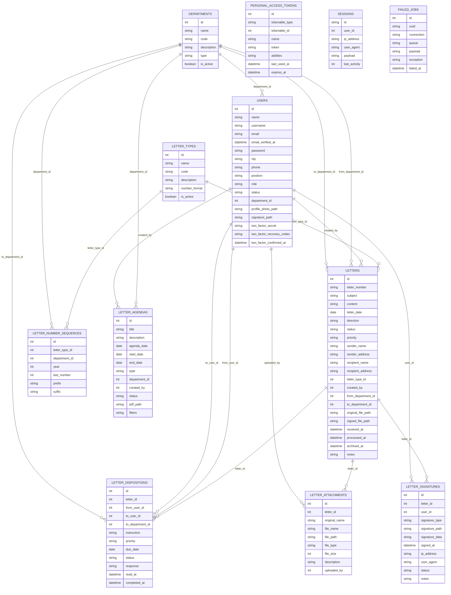

# Database Design — E‑Surat Universitas Bakrie

Dokumen ini merangkum rancangan database berdasarkan seluruh migration dan model Eloquent yang ada di repo ini. Mencakup ERD, deskripsi tabel, relasi, enum/state, indexing, serta catatan implementasi untuk fitur utama: tracking surat, arsip digital, tanda tangan elektronik/digital, penomoran otomatis, dan agenda PDF.

## ERD (Mermaid)

Diagram di bawah menggunakan Mermaid (dirender otomatis oleh GitHub/VS Code Markdown Preview).

Catatan: Tabel pendukung standar Laravel (sessions, personal_access_tokens, failed_jobs) disertakan untuk kelengkapan namun tidak menjadi domain inti.

---

## Ringkasan Sistem

E‑Surat mengelola surat masuk/keluar, disposisi, lampiran, penomoran otomatis, tanda tangan, dan agenda PDF. Role: admin, rektorat, unit_kerja. Dokumen ini memetakan tabel, relasi, state machine, serta alur data untuk fitur:

-   Tracking surat (masuk & keluar)
-   Arsip digital
-   Tanda tangan elektronik/digital (opsional)
-   Penomoran otomatis
-   Agenda surat (web → PDF)

---

## Deskripsi Entitas dan Tabel

### users

Identitas dan otorisasi pengguna.

Kolom utama:

-   id (PK)
-   name, username (unique), email (unique), password
-   email_verified_at (nullable)
-   nip (unique, nullable), phone (nullable), position (nullable)
-   role enum: admin|rektorat|unit_kerja (default unit_kerja)
-   status enum: active|inactive (default active)
-   department_id (FK → departments.id, nullable, ON DELETE SET NULL)
-   profile_photo_path (nullable), signature_path (nullable)
-   two_factor_secret, two_factor_recovery_codes, two_factor_confirmed_at (opsional via Fortify)
-   timestamps

Relasi Eloquent:

-   belongsTo department
-   hasMany: createdLetters, sentDispositions, receivedDispositions, uploadedAttachments, letterSignatures, createdAgendas

Index/Constraint: username unique, email unique, department_id FK

### departments

Master unit kerja/rektorat.

Kolom:

-   id (PK), name, code (unique), description (nullable)
-   type enum: rektorat|unit_kerja (default unit_kerja)
-   is_active boolean (default true)
-   timestamps

Relasi:

-   hasMany: users, lettersFrom (from_department_id), lettersTo (to_department_id), letterNumberSequences, letterAgendas, letterDispositions (to_department_id)

### letter_types

Master jenis surat.

Kolom:

-   id (PK), name, code (unique), description (nullable)
-   number_format (nullable)
-   is_active boolean (default true)
-   timestamps

Relasi: hasMany letters, letterNumberSequences

### letters

Entitas surat (masuk/keluar) termasuk konten, status, dan tracking.

Kolom:

-   id (PK)
-   letter_number (unique)
-   subject, content (nullable)
-   letter_date (date)
-   direction enum: incoming|outgoing
-   status enum: draft|pending|processed|archived|rejected (default draft)
-   priority enum: low|normal|high|urgent (default normal)
-   sender_name/address (nullable), recipient_name/address (nullable)
-   letter_type_id (FK → letter_types.id, RESTRICT)
-   created_by (FK → users.id, RESTRICT)
-   from_department_id, to_department_id (FK → departments.id, nullable, ON DELETE SET NULL)
-   original_file_path, signed_file_path (nullable)
-   received_at, processed_at, archived_at (nullable)
-   notes (nullable), timestamps

Index: (direction,status), letter_date, created_by

Relasi: belongsTo letterType, creator, fromDepartment, toDepartment; hasMany dispositions, attachments, signatures

### letter_dispositions

Pencatatan disposisi surat antar user/departemen.

Kolom:

-   id (PK)
-   letter_id (FK → letters.id, CASCADE)
-   from_user_id, to_user_id (FK → users.id, RESTRICT)
-   to_department_id (FK → departments.id, nullable, SET NULL)
-   instruction (text), priority enum, due_date (nullable)
-   status enum: pending|in_progress|completed|returned (default pending)
-   response (nullable), read_at (nullable), completed_at (nullable)
-   timestamps

Index: letter_id, (to_user_id,status), due_date

Relasi: belongsTo letter, fromUser, toUser, toDepartment

### letter_attachments

Lampiran file untuk surat.

Kolom:

-   id (PK)
-   letter_id (FK → letters.id, CASCADE)
-   original_name, file_name, file_path, file_type, file_size
-   description (nullable)
-   uploaded_by (FK → users.id, RESTRICT)
-   timestamps

Index: letter_id

Relasi: belongsTo letter, uploader

### letter_signatures

Tanda tangan surat (digital/electronic).

Kolom:

-   id (PK)
-   letter_id (FK → letters.id, CASCADE)
-   user_id (FK → users.id, RESTRICT)
-   signature_type enum: digital|electronic (default digital)
-   signature_path (nullable), signature_data (nullable)
-   signed_at (nullable), ip_address (nullable), user_agent (nullable)
-   status enum: pending|signed|rejected (default pending)
-   notes (nullable), timestamps

Index: letter_id, user_id

Relasi: belongsTo letter, user

### letter_number_sequences

Penomoran otomatis per kombinasi (jenis surat, departemen opsional, tahun).

Kolom:

-   id (PK)
-   letter_type_id (FK → letter_types.id, CASCADE)
-   department_id (FK → departments.id, CASCADE, nullable)
-   year (YEAR)
-   last_number (uint, default 0)
-   prefix, suffix (nullable)
-   timestamps

Unique: (letter_type_id, department_id, year)

Relasi: belongsTo letterType, department

Perilaku (model): getNextNumber(), generateLetterNumber(), generateUniqueLetterNumber(), findOrCreate()

### letter_agendas

Agenda surat (periode, filter, output PDF).

Kolom:

-   id (PK)
-   title, description (nullable)
-   agenda_date, start_date, end_date
-   type enum: daily|weekly|monthly (default monthly)
-   department_id (FK → departments.id, SET NULL, nullable)
-   created_by (FK → users.id, RESTRICT)
-   status enum: draft|published|archived (default draft)
-   pdf_path (nullable)
-   filters (json, nullable)
-   timestamps

Index: agenda_date, department_id, status

Relasi: belongsTo department, creator

### Tabel Pendukung

-   sessions: penyimpanan sesi Laravel
-   personal_access_tokens: token API (Sanctum)
-   failed_jobs: log kegagalan queue

---

## State Machine (Enum/Status)

-   users.role: admin | rektorat | unit_kerja
-   users.status: active | inactive
-   departments.type: rektorat | unit_kerja
-   letters.direction: incoming | outgoing
-   letters.status: draft → pending → processed → archived; atau pending → rejected
-   letters.priority: low | normal | high | urgent
-   letter_dispositions.status: pending → in_progress → completed; atau returned
-   letter_dispositions.priority: low | normal | high | urgent
-   letter_signatures.signature_type: digital | electronic
-   letter_signatures.status: pending | signed | rejected
-   letter_agendas.type: daily | weekly | monthly
-   letter_agendas.status: draft | published | archived

Pastikan logika aplikasi menegakkan transisi yang valid dan sinkron dengan proses bisnis.

---

## Penomoran Surat

Sumber data: `letter_number_sequences` digabung `letter_types.number_format`.

-   Dimensi: `letter_type_id`, `department_id` (opsional), `year`
-   `last_number` bertambah saat generate
-   Placeholder format yang didukung model:
    -   {number} — nomor ber-padding (default 3 digit)
    -   {code} — kode jenis surat (`letter_types.code`)
    -   {department_code} — kode departemen (jika sequence terkait departemen)
    -   {month} — 01..12
    -   {month_roman} — I..XII
    -   {year} — YYYY
    -   {prefix} / {suffix} — dari sequence

Fallback format default (di model):
`{number}/UB/R-{code}/{month_roman}/{year}`

Contoh yang umum dipakai kampus:
`{number}/UB/{department_code}/{code}/{month_roman}/{year}`

---

## Mapping Fitur ↔ Tabel

-   Tracking Surat: `letters` (status, timestamps) + `letter_dispositions` + `letter_signatures`
-   Arsip Digital: `letters.original_file_path`/`signed_file_path`, `letter_attachments`
-   Tanda Tangan: `letter_signatures` (status, signed_at, ip, user_agent, path/data)
-   Penomoran: `letter_number_sequences` + `letter_types.number_format` + `letters.letter_number`
-   Agenda PDF: `letter_agendas.filters` → query `letters` → simpan ke `pdf_path`

---

## Indeks & Kinerja

-   letters: (direction, status), letter_date, created_by
-   letter_dispositions: letter_id, (to_user_id, status), due_date
-   letter_attachments: letter_id
-   letter_signatures: letter_id, user_id
-   letter_agendas: agenda_date, department_id, status
-   Unique constraints: users.username, users.email, departments.code, letter_types.code, letters.letter_number, letter_number_sequences (type, department, year)

---

## Seeder Jenis Surat (usulan kode)

Silakan sesuaikan di `database/seeders/LetterTypeSeeder.php`.

1. Surat Keluar → OUT
2. Surat Edaran → SE
3. Surat Tugas → ST
4. Surat Pengumuman → PENG
5. Internal Memo → IM
6. Surat Ijin Atasan → SIA
7. Surat Perintah → SPR
8. Surat Keterangan → SKET
9. Surat Rekomendasi → SR
10. Surat Pernyataan → SPN
11. Surat Peringatan → SP
12. Surat Pernyataan Tanggung Jawab Mutlak → SPTJM
13. Surat Kuasa → SKU
14. Pakta Integritas → PI
15. Surat Perintah Kerja → SPK
16. Surat Keputusan Rektor → SKR
17. Peraturan Rektor → PR
18. Peraturan Universitas → PU
19. MOU → MOU
20. PKS → PKS

Rekomendasi number_format default: `{number}/UB/{department_code}/{code}/{month_roman}/{year}`

---

## Catatan Desain & Rekomendasi

-   Draft tanpa nomor: saat ini `letters.letter_number` adalah NOT NULL dan UNIQUE. Jika ingin membuat draft tanpa nomor, pertimbangkan menjadikannya nullable dan mengisi saat submit; atau gunakan placeholder unik (UUID) lalu ganti saat submit.
-   Konsistensi path file: `original_file_path` (file awal), `signed_file_path` (final), lampiran di `letter_attachments.file_path`.
-   `letter_number_sequences.department_id` nullable memungkinkan skema penomoran global atau per-departemen.
-   Terapkan policy/authorization per role untuk query sensitif (misal batasan akses per departemen bagi unit_kerja).

---

## Versi dan Sumber

Sesuai migrasi di `database/migrations` dan model di `app/Models` pada branch saat ini. Jika skema berubah, perbarui ERD dan bagian yang relevan di dokumen ini.
