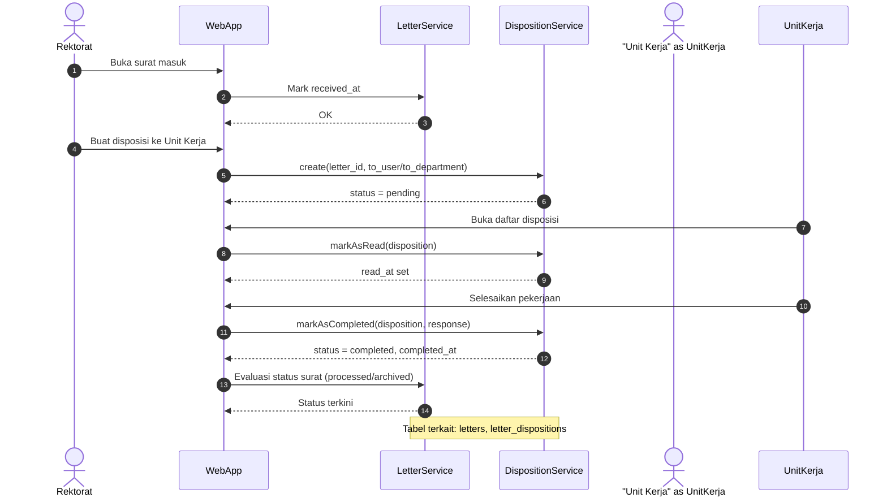
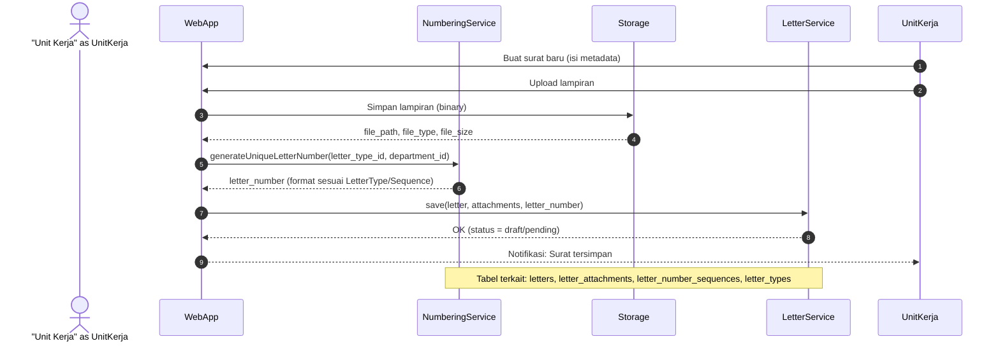

# Sequence Diagrams — E‑Surat (Mermaid)

Dokumen ini menyajikan diagram urutan (sequence) utama sistem E‑Surat menggunakan Mermaid. Kode dapat dirender langsung di GitHub, VS Code (dengan ekstensi Mermaid), atau alat pendukung Mermaid lainnya.

## Incoming Letter Disposition Workflow



## Outgoing Letter Creation — Auto Number & Attachments



## Catatan

-   Mermaid ditulis dalam blok kode ```mermaid agar dapat dirender otomatis.
-   Nama partisipan diselaraskan dengan terminologi di kode/model: LetterService, DispositionService, NumberingService, Storage.
-   Alur di atas mengacu pada rancangan di `system.puml` dan dokumen desain database.
